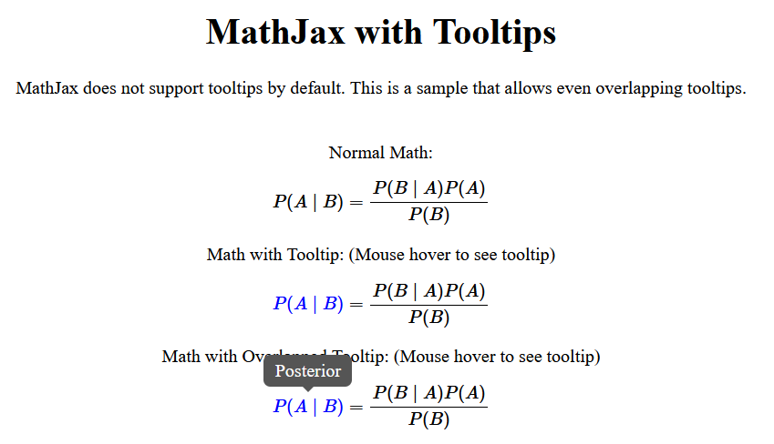
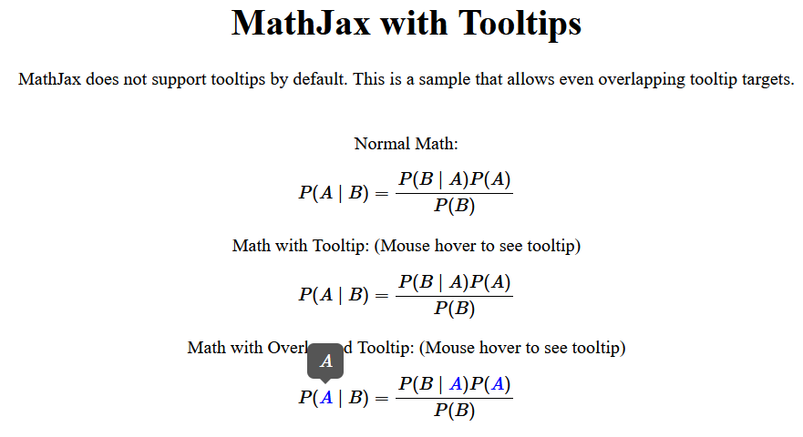

# MathJax with Tooltips

MathJax does not support tooltips by default. This is a sample that allows even overlapping tooltip targets.

The tooltips pop outs when mouse enters, and disappears when mouse leaves. If there are overlapping targets, only the child's tooltip will be shown.

We use MathJax 3.2.0. Similarly, MathJax 2.x can achieve similar effect.

[Try out the Demo here!][link]

## Screenshots

[][link]

[][link]

[link]: https://j3soon.github.io/mathjax-tooltips/
